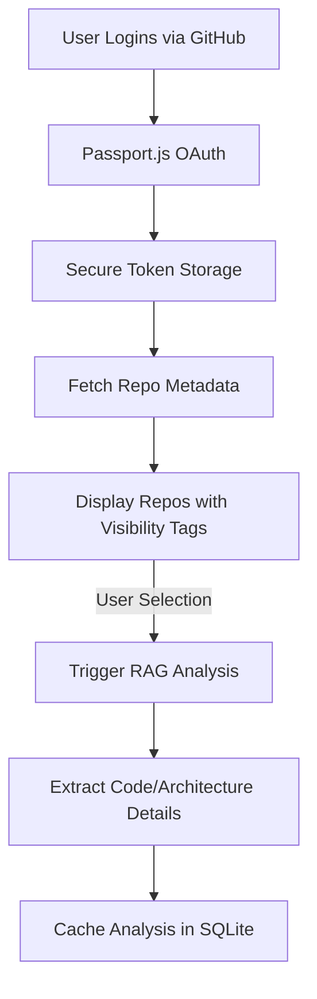
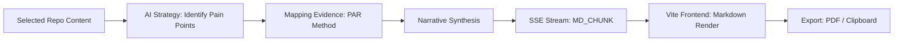

# 🚀 RepoResume — AI-Driven Portfolio & Social Architect

**RepoResume** is an AI-powered engineering portfolio and branding architect. It autonomously analyzes your GitHub repositories using Retrieval-Augmented Generation (RAG) to distill complex codebases into high-impact, ATS-optimized resumes, custom cover letters, and viral LinkedIn posts. Built with a high-fidelity React frontend and a robust Node.js backend, it leverages the power of Llama-3.3-70B via NVIDIA NIM to consolidate your technical identity into professional narratives.


---

## ✨ Key Features

- **🧠 RAG-Powered Context Extraction**: Automatically crawls your public/private GitHub repositories to understand technical implementation details.
- **✨ Social Branding (NEW)**: Convert your technical achievements into high-engagement LinkedIn posts with professional "hooks" and direct repo links.
- **🎯 Intelligent Job Matching**: Uses AI to filter and pick the top 3-4 most relevant projects for each specific job description (JD).
- **📊 ATS Optimization**: Mandates keywords, mirrors job titles, and uses professional, parseable formatting for maximum impact.
- **⚡ Real-Time Streaming UI**: Built with Server-Sent Events (SSE) for live-streaming content generation with detailed phase-tracking.
- **🛡️ Privacy Aware**: Clear "Public/Private" labeling for your repositories to ensure you only share what you intend to.
- **🔒 Persistent Profile Security**: Secure GitHub OAuth authentication with permanent profile storage via SQLite.

---

## 🛠️ Technology Stack

- **Frontend**: React (Vite), Tailwind CSS, Framer Motion (Animations), Lucide (Icons), Zustand (State).
- **Backend**: Node.js, Express, Passport.js (GitHub OAuth), Better-SQLite3.
- **AI Engine**: NVIDIA AI-Inference (Llama-3.3-70B / DeepSeek v3.1) for RAG and narrative synthesis.
- **Networking**: Server-Sent Events (SSE) for real-time progress & markdown streaming.

---

## 📐 Workflows & Architecture

### 1. Data & Authentication Flow


### 2. The Generation Architect (Resume / LinkedIn)


---

## 🚀 Local Setup & Usage

### 1. Prerequisites
- **Node.js** (v18.x or higher)
- **Git**
- **GitHub OAuth App**: Create one at [GitHub Developer Settings](https://github.com/settings/developers). set the callback to `http://localhost:3001/auth/github/callback`.
- **NVIDIA AI API Key**: Get access to Llama-3.3-70B via [NVIDIA NIM](https://www.nvidia.com/en-us/ai-data-science/generative-ai/nim/).

### 2. Installation
```bash
# Clone the repository
git clone https://github.com/RA-L-PH/RepoResume.git
cd RepoResume

# Install dependencies (Root, Client, and Server)
npm install
cd client && npm install
cd ../server && npm install
```

### 3. Environment Configuration
Create a `.env` file in the `/server` directory:
```env
GITHUB_CLIENT_ID=your_github_client_id
GITHUB_CLIENT_SECRET=your_github_client_secret
NVIDIA_API_KEY=your_nvidia_nim_key
SESSION_SECRET=a_random_long_string
CALLBACK_URL=http://localhost:3001/auth/github/callback
FRONTEND_URL=http://localhost:5173
```

### 4. Launching the App
In the root directory, run:
```bash
npm run dev
```
- **Frontend playground**: `http://localhost:5173`
- **Backend API**: `http://localhost:3001`

---

## 📖 How to Use

1. **Login**: Authenticate with GitHub to sync your repository list.
2. **Intelligence**: Select repositories and run **"Extract Technical Identity"**. This allows the AI to "read" your code and store it in a technical graph.
3. **Architect (Resume)**: Fill in your work history and education, select your target role, and hit **"Synthesize Resume"**. 
4. **Narrative (Cover Letter)**: Paste a Job Description and recent company news. Use the **"Venture Intelligence"** tool (Zap icon) to automatically scrape and summarize company links.
5. **Social (LinkedIn)**: Select a "Vibe" (Personal or Professional), select your top repos, and generate a viral LinkedIn post to share your build with your network.

---

## 🤝 Contributing & Support

Contributions are what make the open-source community such an amazing place to learn, inspire, and create. Any contributions you make are **greatly appreciated**.

1. Fork the Project
2. Create your Feature Branch (`git checkout -b feature/AmazingFeature`)
3. Commit your Changes (`git commit -m 'Add some AmazingFeature'`)
4. Push to the Branch (`git push origin feature/AmazingFeature`)
5. Open a Pull Request

---

## 📄 License

This project is licensed under the MIT License. Produced with ❤️ by [RA-L-PH](https://github.com/RA-L-PH).
